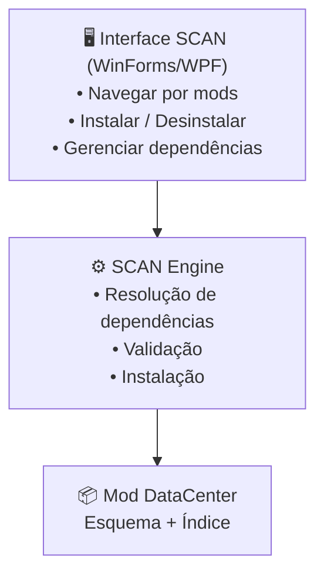
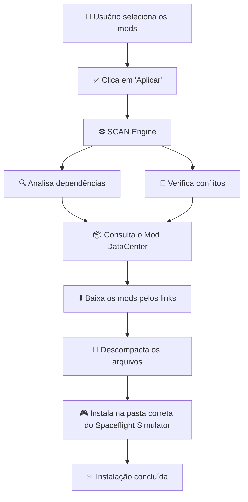

# 🚀 SCAN - SFS Comprehensive Addon Network


Um gerenciador de mods moderno e inteligente para **Spaceflight Simulator**, inspirado no famoso CKAN do Kerbal Space Program.
<br>
<br>
## 🎯 O que é SCAN?

SCAN é uma solução completa para gerenciar mods no SFS que vai muito além de um simples instalador:

- 🎯 **Gerenciamento de Dependências** - Instala automaticamente mods necessários
- 🚫 **Detecção de Conflitos** - Identifica mods incompatíveis antes de instalar
- 📦 **Interface Intuitiva** - Fácil de usar, mesmo para iniciantes
- 🔄 **Atualizações Automáticas** - Mantenha seus mods sempre atualizados
- 🗂️ **Organização Central** - Um repositório unificado de todos os mods disponíveis

## 🎮 Como Funciona?


### Como o SCAN é organizado


---

### Como o SCAN instala um mod



---

## 🛠️ Recursos Planejados

**legenda**
✅ = Pronto   
📅 = Planejado      
🛠️ = Em progresso     

**lista:**
- 🛠️ Versão Console    
- 📅 Interface gráfica (WPF)   
- 📅 API REST para integração  
- 📅 Sistema de cache local
- 📅 Motor de resolução de dependências
- 📅 Motor de resolução de Conflitos
- 📅 Configurações para modo Escuro/Claro

## 📋 Requisitos

- **.NET 9.0** ou superior
- **Windows 7+**
- Spaceflight Simulator instalado

## 🚀 Começando

### Instalação

1. Baixe a versão mais recente em [Releases](https://github.com/Del-SFS/SFS-Comprehesive-Addon-Network/releases)
2. Execute o instalador
3. Aponte para sua pasta do SFS
4. Pronto! 🎉

### Uso Básico

1. Abra SCAN
2. Navegue pelos mods disponíveis
3. Clique em "Instalar" no mod desejado
4. SCAN cuida do resto (dependências, conflitos, etc)

## 📚 Documentação

- [Como usar SCAN](./docs/USAGE.md)
- [Adicionar um mod](./docs/CONTRIBUTING.md)
- [Estrutura do projeto](./docs/ARCHITECTURE.md)

## 🤝 Contribuindo

Você pode contribuir de várias formas:

### Adicionando Mods
Veja [CONTRIBUTING.md](./CONTRIBUTING.md) para adicionar seu mod ao DataCenter

### Reportando Bugs
[Abra uma issue](https://github.com/Del-SFS/SFS-Comprehesive-Addon-Network/issues) descrevendo o problema

### Desenvolvendo
Quer contribuir com código? Faça um fork, crie uma branch e envie um PR!

```bash
git clone https://github.com/Del-SFS/SFS-Comprehesive-Addon-Network.git
cd SFS-Comprehesive-Addon-Network
dotnet build
```

## 📝 Licença

Este projeto está licenciado sob a [MIT License](./LICENSE).

## ⚖️ Aviso Legal

Spaceflight Simulator é uma marca registrada de [Team Curiosity](https://teamcuriosity.com).  
Este projeto **NÃO é afiliado** aos desenvolvedores oficiais.

## 💬 Suporte

- **Issues**: [GitHub Issues](https://github.com/Del-SFS/SFS-Comprehesive-Addon-Network/issues)

**Made with ❤️ by Del**

